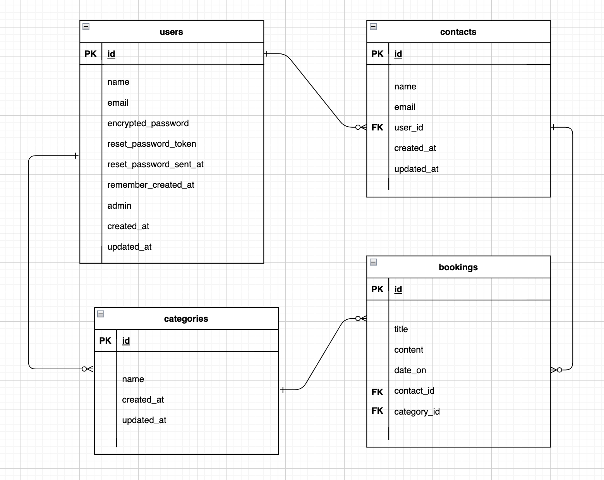

# 卒業課題
## 開発言語バージョン
 - rails 6.1.6
 - ruby 3.0.1

## 就業Termで学んだ技術
 - devise
 - AWS EC2

## カリキュラム外技術
 - simple_calender
 - ransack

 ## アプリケーションの実行手順
  ```
  $ git clone https://github.com/Jinteng-Yougui/graduation_app.git 
  $ cd graduation_app
  $ bundle install
  $ yarn install
  $ rails db:create && rails db:migrate
  $ rails s
  ```

## カタログ設計、テーブル定義書、ワイヤーフレームの共有リンク
 [カタログ設計](https://docs.google.com/spreadsheets/d/1_TFuGwPiHCuG-bPi9dH-qgoztzAOmDAhTqOLpczz1gI/edit?usp=sharing)  
 [テーブル定義書](https://docs.google.com/spreadsheets/d/1e8fFRM11rXSeeq2lpBC3qI-VcUNWEEvjdLwvdZyqtno/edit?usp=sharing)  
 [ワイヤーフレーム](https://drive.google.com/file/d/1NUPZoTZOaiiGZwh5tmbf4bAt8yGQbgQW/view?usp=sharing)

##  ER図、画面遷移図の画像
   
 